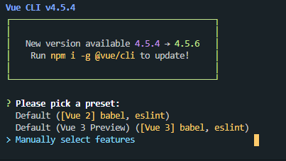
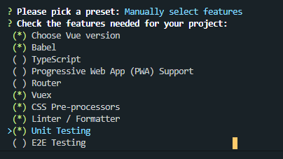
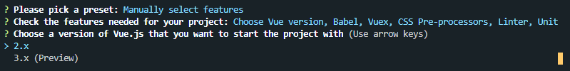
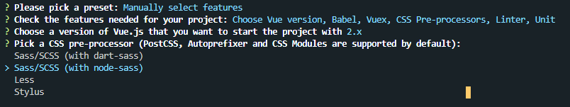
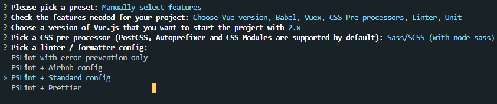
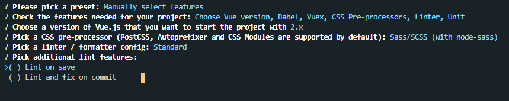
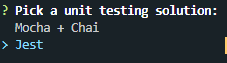
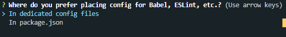
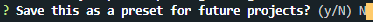

# vue-05-jest-test

## 1. 설치 방법

단위 테스트 모듈을 사용하기 위해 프로젝트를 생성하기 전에 다음의 모듈을 설치한다.

`npm i -g jest`

## 2. 프로젝트 생성하기

`vue create jest-test`와 같이 테스트할 프로젝트를 새로 만듦.

### 2-1. 프로젝트 수동 설정

- 프로젝트에서 jest모듈을 사용하기 위해서는 vue-cli에서 제공하는 수동 옵션을 사용해야 프로젝트를 생성할 때 jest 모듈을 설치할 수 있다.

1. 다음의 항목에서 `Manually select features` 항목을 선택한다.
   

2. 다음의 항목에서 6가지를 체크한다. - [x] Choose Vue version - [x] Babel - [x] Vuex - [x] CSS Pre-processors - [x] Linter / Formatter - [x] Unit Testing
   

3. Vue.js 버전 고르기

- 2.x
  

4. Sass/SCSS (with node-sass)
   

5. ESLint + Standard config 선택
   

6. 아무 곳도 체크하지 않는다. (Pick additional lint features)
   

7. Jest 모듈 선택
   

8. 별도의 파일 분리하여 관리 (config files)
   

9. 다음에도 이 설정을 저장할 것이냐는 물음에는 N라고 답한다.
   

## 3. Jest API Docs

### 3-1. Global

- [API](https://jestjs.io/docs/en/api)

- afterAll: 모든 테스트의 가장 마지막 부분에 한 번만 실행
- afterEach: 모든 테스트 뒤에 한 번씩 실행
- beforeAll: 모든 테스트의 가장 앞 부분에 한 번만 실행
- beforeEach: 모든 테스트 앞에 한 번씩 실행

```javascript
import { addOne } from '../calc.js';

describe(addOne, () => {
  beforeAll(() => {
    console.log('beforeAll');
  });
  afterAll(() => {
    console.log('afterAll');
  });
  beforeEach(() => {
    console.log('beforeEach');
  });
  afterEach(() => {
    console.log('afterEach');
  });

  test('1', () => {
    console.log('test1');
  });
  test('2', () => {
    console.log('test2');
  });
});
```

위의 코드는 다음의 실행 순서로 동작한다.

beforeAll
→ beforeEach → test1 → afterEach
→ beforeEach → test2 → afterEach
→ afterAll

### 3-2. Using Matchers (일치하는지 확인)

#### 자주 쓰는 Methods

- .toBe(value)
